# How to set up a data processing + analysis workflow with Fragpipe and Fragpipe Analyst

------------------------------------------------------------------------

This tutorial guides you through processing DIA data with Fragpipe and analyzing results with Fragpipe Analyst.

⚠️ **Critical:** Fragpipe Analyst **only** works with data processed by Fragpipe. Download Fragpipe from https://fragpipe.nesvilab.org/ before starting.

## Table of Contents

1.  [Prerequisites](#prerequisites)
2.  [Part 1: Processing DIA Data with Fragpipe](#how-to-use-fragpipe-to-process-dia-data)
3.  [Part 2: Analyzing Data with Fragpipe Analyst](#how-to-use-fragpipe-analyst-to-analyze-your-processed-data)

------------------------------------------------------------------------

## Prerequisites {#prerequisites}

Before starting this tutorial, ensure you have:

### System Requirements

-   **Administrator access** to your computer (required to run Fragpipe)
-   **Minimum 16 GB RAM** required; 32 GB or more is recommended for large datasets
-   **Sufficient disk space:** at least 3x the size of your raw data files

💡 **Note:** If you are remotely accessing a high-performance computing (HPC) server, these specifications are typically already met.

### Required Files

-   **Raw data files** (.raw format from your mass spectrometer)
-   **FASTA file** for your organism(s) of interest, OR know the species name to download directly from Fragpipe

### Software

-   **Fragpipe** installed on your computer (download from https://fragpipe.nesvilab.org/)
-   Fragpipe will prompt you to download additional components (MSFragger, DIA-NN, Python) during setup

### Important Notes

⏱️ **Estimated time:** Data processing typically takes 30-120 minutes depending on the number of files and your computer's specifications.

------------------------------------------------------------------------

## How to use Fragpipe to process DIA data {#how-to-use-fragpipe-to-process-dia-data}

### Step 1: Launch Fragpipe as administrator

Locate the Fragpipe shortcut on your desktop and right-click it, then select **"Run as administrator"**.

⚠️ **Important:** Fragpipe must be run as administrator or it will not function properly.

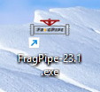


**Alternative:** If you can't find the desktop shortcut, press the Windows key to search for Fragpipe, then select **"Run as administrator"**.

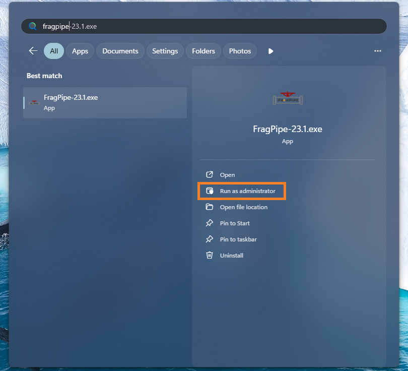

### Step 2: Verify Config tab

Fragpipe should open to the **Config** tab:

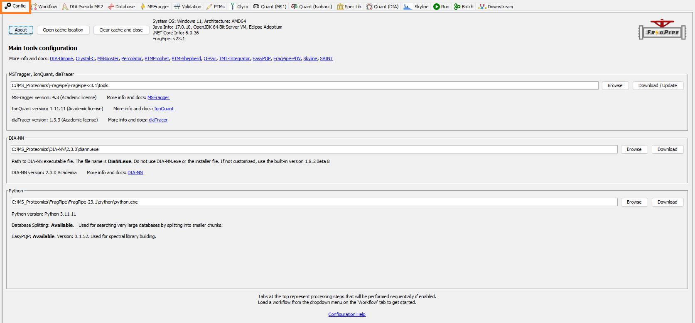

### Step 3: Download MSFragger

Click **Download / Update** to install required software components.


### Step 4: Register for MSFragger academic license

A separate menu will pop up, asking for your credentials to obtain an academic license for MSFragger. Enter your name, email, and institution, agree to the terms and conditions, then click **Send Verification Email**. Check your email (including spam folder) for the verification code and enter it in the box. When you are done, click **Download**.

💡 **Tip:** This is a one-time registration. The verification email usually arrives within a few minutes.

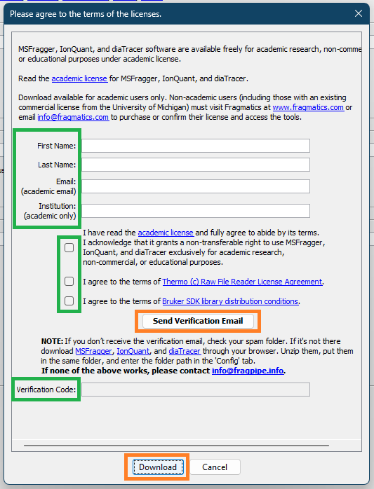

### Step 5: Download DIA-NN

If "DIA-NN" doesn't show a version number, click **Download**. (Fragpipe may already include it.)

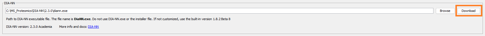

### Step 6: Download Python

If Python doesn't show a version number, click **Download**. Python is required for report generation.

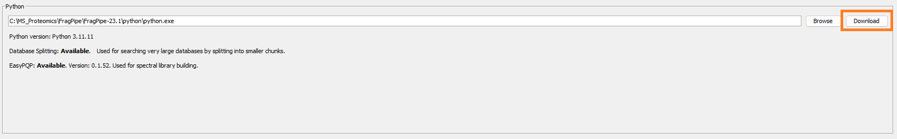

✅ **Checkpoint:** Verify all three components show version numbers: - MSFragger - DIA-NN - Python

### Step 7: Navigate to Workflow tab

Click the **Workflow** tab:

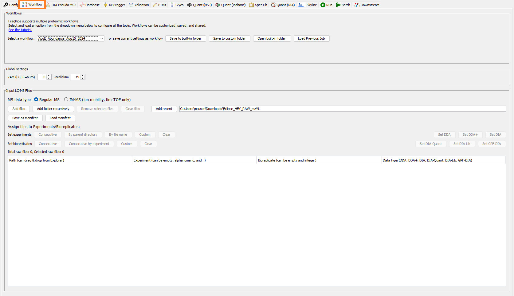

### Step 8: Select DIA workflow

Select **DIA_Umpire_SpecLib_Quant** (the recommended workflow for DIA quantification with spectral library generation).

💡 **Tip:** The default settings work well for most users. Advanced users who need to adjust parameters (enzyme specificity, mass tolerances, etc.) can refer to the [Fragpipe documentation](https://fragpipe.nesvilab.org/docs/tutorial_dia.html).

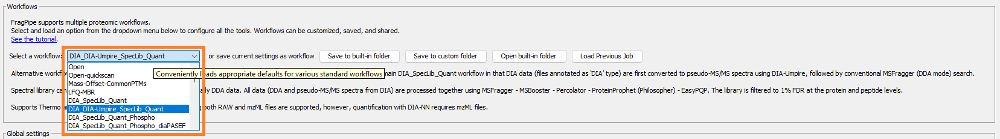

### Step 9: Add raw files

Navigate to the **Input** tab and click **Add files** to add your .raw files (you can select multiple files at once).

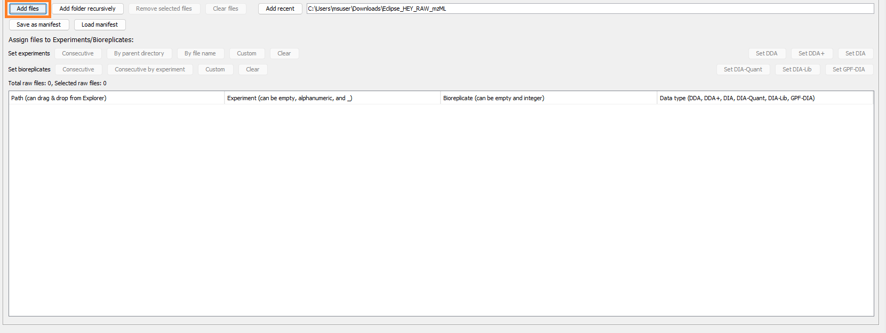

### Step 10: Verify files are added

Your files should now appear in the list. Check the total count at the bottom.

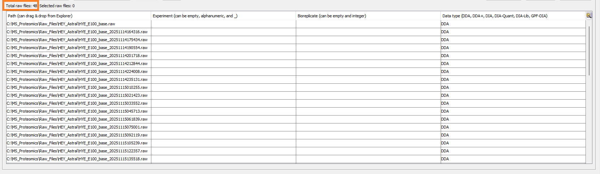

### Step 11: Set files as DIA mode

Select all files (click one, then press **Ctrl + A**), then click **Set DIA**.

⚠️ **Important:** This workflow only works with DIA data. Do not use it for DDA data.

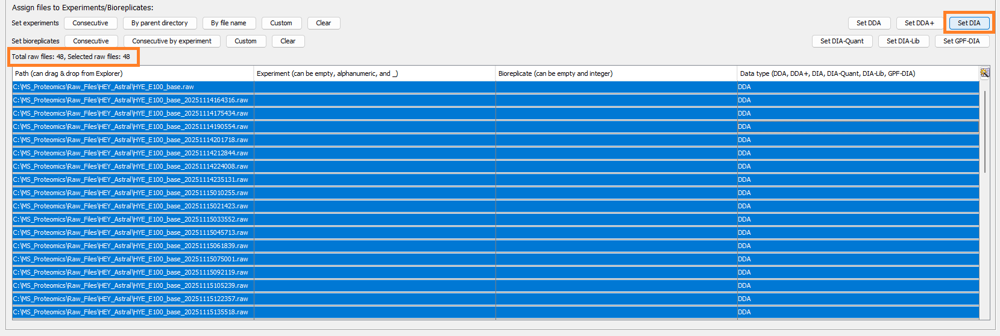

### Step 12: Verify DIA label

Confirm the **Data Type** column shows "DIA" for all files:

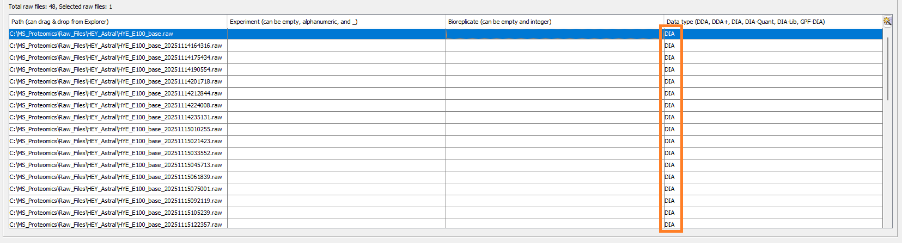

### Step 13: Assign experiments and bioreplicates ⚠️ CRITICAL STEP

You need to name the experimental condition for each file and assign bioreplicate numbers.

**How to assign experiments and bioreplicates:** - **Experiment column:** Enter the condition name (e.g., "Control", "Treatment", "High_Dose") - **Bioreplicate column:** Enter a number for each replicate (e.g., 1, 2, 3) - Files from the same condition should have the **same Experiment name** but **different Bioreplicate numbers**

**Example:** - Control_rep1.raw → Experiment: "Control", Bioreplicate: 1 - Control_rep2.raw → Experiment: "Control", Bioreplicate: 2 - Control_rep3.raw → Experiment: "Control", Bioreplicate: 3 - Treatment_rep1.raw → Experiment: "Treatment", Bioreplicate: 1 - Treatment_rep2.raw → Experiment: "Treatment", Bioreplicate: 2 - Treatment_rep3.raw → Experiment: "Treatment", Bioreplicate: 3

⚠️ **Common mistakes to avoid:** - Using different names for the same condition ("Control" vs "control" vs "Ctrl") - Assigning the same bioreplicate number to different samples in the same condition - Leaving experiment or bioreplicate fields blank

This information is **essential** for Fragpipe Analyst to perform statistical comparisons correctly.

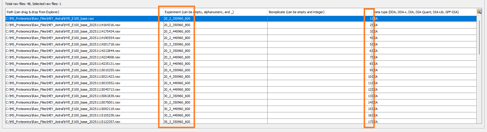

### Step 14: Verify experimental design

Your Input tab should now look similar to this:

✅ **Checkpoint - Verify before proceeding:**

-   [ ] All files have an Experiment name

-   [ ] All files have a Bioreplicate number

-   [ ] Replicates of the same condition have the same Experiment name

-   [ ] Replicates of the same condition have different Bioreplicate numbers

-   [ ] Experiment names are spelled consistently (case-sensitive)

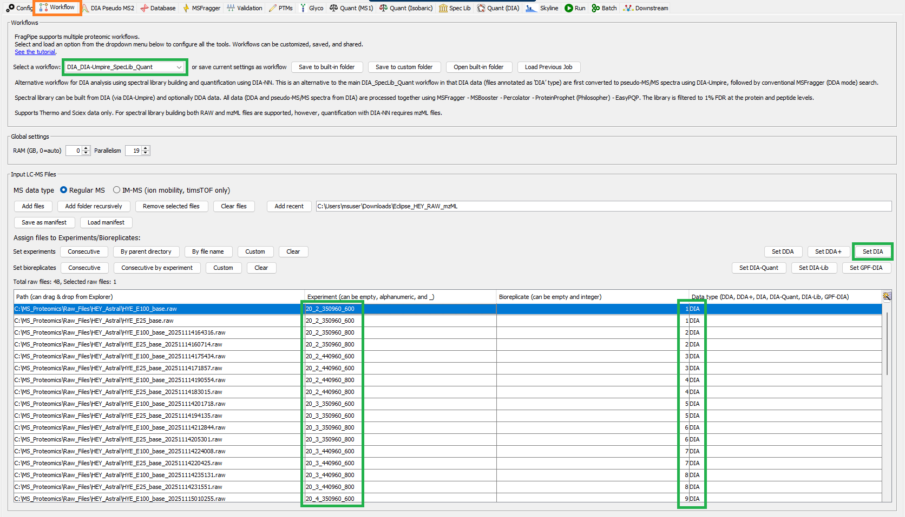

### Step 15: Add FASTA file

Navigate to the **Database** tab and add your FASTA file:

**Choose one option:** - Click **Add** if you already have a FASTA file - Click **Download** to get a FASTA file from UniProt (works best for single-species samples)

💡 **Tip:** For multi-species samples or custom databases, use the **Add** button with a pre-prepared FASTA file.

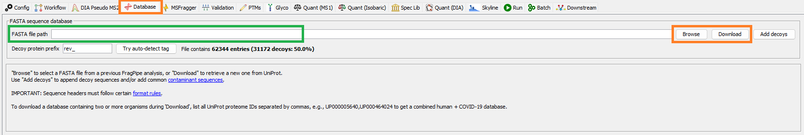

### Step 16: Add decoy sequences

Once your FASTA file appears in the database path, click **Add decoys** to generate decoy sequences.

⚠️ **Important:** Decoy sequences are essential for false discovery rate (FDR) calculation. Always add decoys before running the analysis.

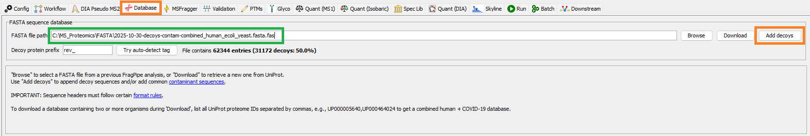

### Step 17: Run the analysis

Navigate to the **Run** tab, click **Browse** to select your output directory (ensure you have at least 3x your raw data size in free space), then click **Run**.

⏱️ **Expected time:** Processing typically takes 30-120 minutes depending on the number of files and your computer specifications.

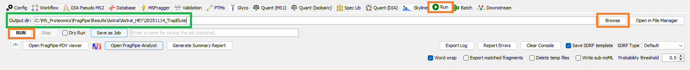

### Step 18: Confirm file conversion

If prompted to convert .raw files to .mzML format, click **Yes**. Fragpipe handles this automatically.

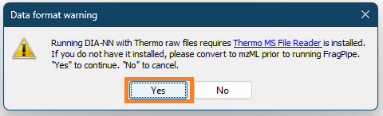

### Step 19: Monitor the processing

Log messages in the console indicate processing has started. The workflow includes file conversion, database searching, and quantification.

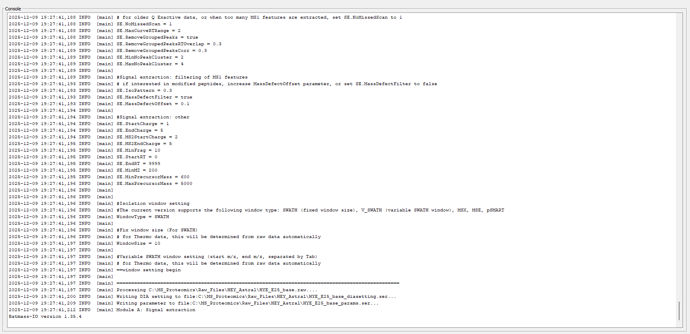

### Step 20: Troubleshooting errors (if needed)

If you see an error message, the run has been aborted.

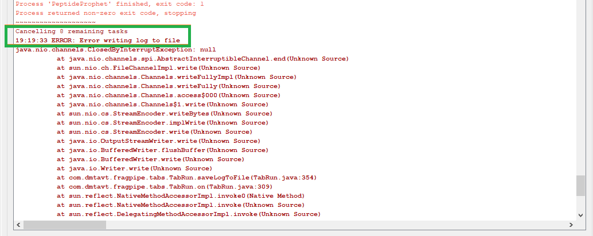

**Common issues and solutions:** - **Insufficient disk space:** Free up space and restart - **Incorrect FASTA file:** Verify proper formatting and protein sequences - **Corrupted raw files:** Check that .raw files are complete - **Missing dependencies:** Return to Steps 5-6 and verify installations - **Memory issues:** Close other programs or process fewer files at once

💡 **Tip:** Check the log messages above the error for specific details about what went wrong.

### Step 21: Verify successful completion

When processing completes successfully, you should see a **"DONE"** message in the console log.

✅ **Success!** Your data has been processed and is now available as .tsv files in your output directory, ready to be analyzed by Fragpipe Analyst!

**Key output files:** - `combined_protein.tsv` - Protein-level results - `combined_peptide.tsv` - Peptide-level results - `diann-output.tsv` - DIA-NN quantification - `experiment.annotation.tsv` - **Required for Fragpipe Analyst** - `report.pg_matrix.tsv` - **Required for Fragpipe Analyst** - `report.pr_matrix.tsv` - Precursor matrix (optional) - QC report files

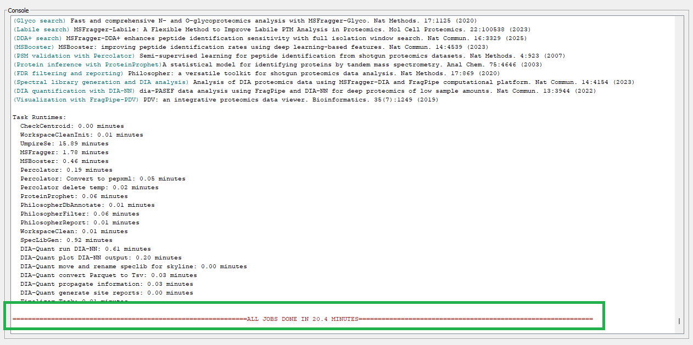

------------------------------------------------------------------------

## How to use Fragpipe Analyst to analyze your processed data {#how-to-use-fragpipe-analyst-to-analyze-your-processed-data}

The key files for Fragpipe Analyst are in the **"fragpipe"** subfolder:

**Required files:** - `experiment.annotation.tsv` - Experimental design - `report.pg_matrix.tsv` - Protein group quantification matrix

### Step 22: Navigate to output directory

Open your output directory. The folder structure should look like this:

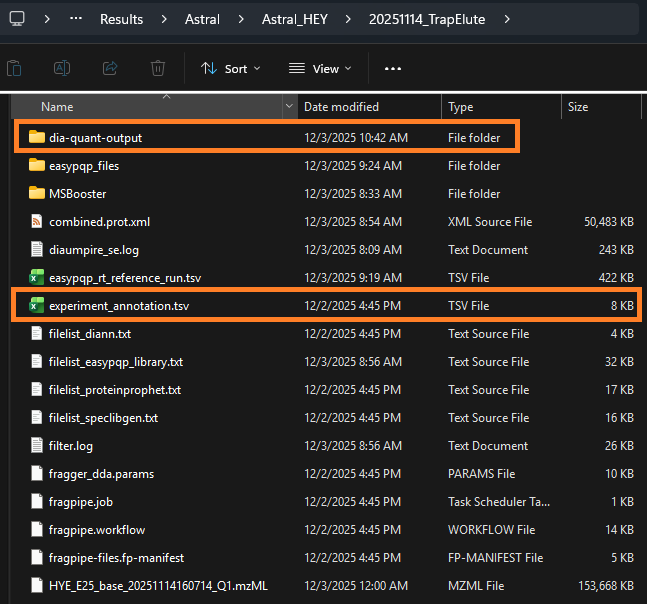

### Step 23: Locate required files

Open the **"fragpipe"** subfolder to find the required files:

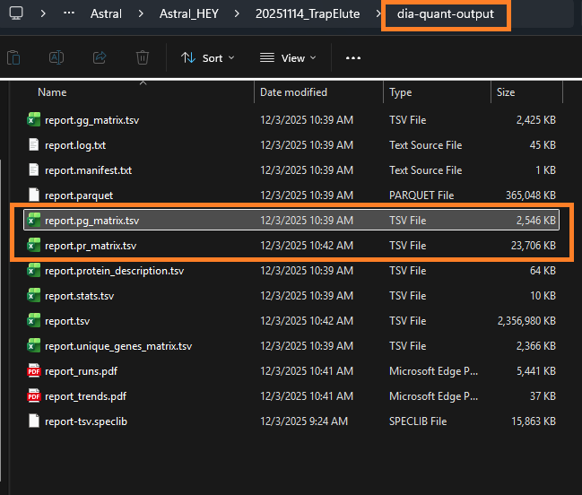

⚠️ **Important:** If you cannot find these files, the Fragpipe processing may not have completed successfully. Return to Step 21 and verify the run completed with a "DONE" message.

### Step 24: Open Fragpipe Analyst

Open https://fragpipe-analyst.org/ in your browser:

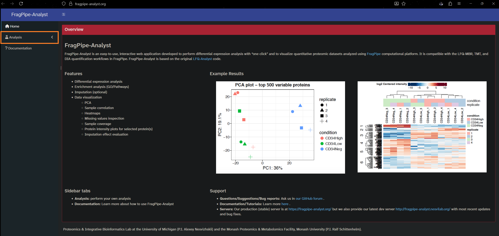

### Step 25: Prepare to upload files

Click **Analysis**, select **DIA** as the data type, and note the two required files. Before uploading, we need to modify the annotation file.

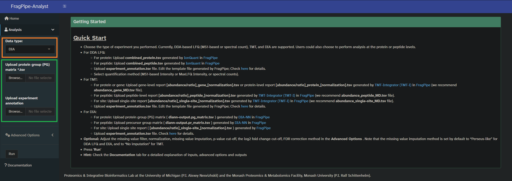

### Step 26: Check experiment.annotation.tsv

Open `experiment.annotation.tsv` in Excel. The file will have columns for `sample`, `sample_name`, and `condition` - the last two need modification:

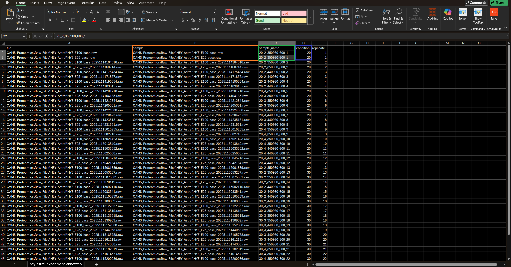

### Step 27: Modify experiment.annotation.tsv for Fragpipe Analyst ⚠️ CRITICAL STEP

The `experiment.annotation.tsv` file created by Fragpipe needs to be modified before it will work with Fragpipe Analyst. There are two critical requirements:

#### Requirement 1: Unique sample_name for every file

**Problem:** Fragpipe may generate duplicate `sample_name` values for different files.

**Example of the problem:**

```         
file                              sample_name       condition
HYE_E100_base.raw                20_2_350960_600_1      20
HYE_E25_base.raw                 20_2_350960_600_1      20  ❌ DUPLICATE!
```

**Solution:** Make each `sample_name` unique by prepending information from the filename:

```         
file                              sample_name              condition
HYE_E100_base.raw                E100_20_2_350960_600_1        E100
HYE_E25_base.raw                 E25_20_2_350960_600_1         E25   ✅ UNIQUE!
```

💡 **Tip:** You can use Python/R scripts or Excel formulas to extract filename components and create unique identifiers. The key is that every row must have a different `sample_name`.

#### Requirement 2: Sufficient replicates per condition

**Problem:** Fragpipe Analyst requires **at least 3 samples per condition** for statistical analysis. If you have too many unique conditions with too few samples each, you'll get an error.

**Example of the problem:**

```         
condition                         # samples
E100_Cycle20_Iso2_MZ350960_AGC600      2    ❌ Too few replicates per condition
E25_Cycle20_Iso2_MZ350960_AGC600       2    ❌ 48 unique conditions total
...
```

**Solution:** Group your samples by the **biological variable you want to compare**, treating other experimental parameters as replicates:

**Option A: Compare E. coli concentrations (E100 vs E25)**

```         
file                              sample_name              condition  replicate
HYE_E100_base.raw                E100_20_2_350960_600_1        E100         1
HYE_E25_base.raw                 E25_20_2_350960_600_1         E25          1
HYE_E100_base_20251114164316.raw E100_20_2_350960_800_2        E100         2
HYE_E25_base_20251114160714.raw  E25_20_2_350960_800_2         E25          2
...
```

Result: 2 conditions (E100, E25) × 24 samples each ✅

**Option B: Compare cycle times (20 vs 30 min)**

```         
condition  # samples
Cycle20         24    ✅
Cycle30         24    ✅
```

**Option C: Compare E. coli × cycle time**

```         
condition         # samples
E100_Cycle20          12    ✅
E100_Cycle30          12    ✅
E25_Cycle20           12    ✅
E25_Cycle30           12    ✅
```

⚠️ **Key principle:** Group samples by your primary biological question. Other parameters become replicates.

#### Step-by-step modification process:

1.  **Open `experiment.annotation.tsv` in Excel, Python, or R**
2.  **Create unique `sample_name` values** by combining filename information with the original sample_name
3.  **Simplify the `condition` column** to group samples appropriately for your comparison
4.  **Verify your design:**
    -   ✅ Every `sample_name` is unique
    -   ✅ Each condition has ≥3 samples (preferably many more)
    -   ✅ The conditions reflect the biological comparison you want to make
5.  **Save the modified file** (keep the tab-delimited .tsv format)

💡 **Pro tip:** Keep a backup of the original file before making changes. You can create multiple versions with different condition groupings to explore different biological questions from the same dataset.

**Example Python code to automate this process:**

``` python
import polars as pl

# Read the annotation file
df = pl.read_csv("experiment.annotation.tsv", separator="\t")

# Extract experimental factor from filename (e.g., E100 or E25)
df = df.with_columns([
    pl.col("file").str.extract(r"(E\d+)", 1).alias("ecoli_conc")
])

# Create unique sample names
df = df.with_columns([
    (pl.col("ecoli_conc") + "_" + pl.col("sample_name")).alias("sample_name")
])

# Simplify condition to just the factor of interest
df = df.with_columns([
    pl.col("ecoli_conc").alias("condition")
])

# Save the corrected file
df.write_csv("experiment.annotation.tsv", separator="\t")
```

After making these modifications, your file is ready for upload:

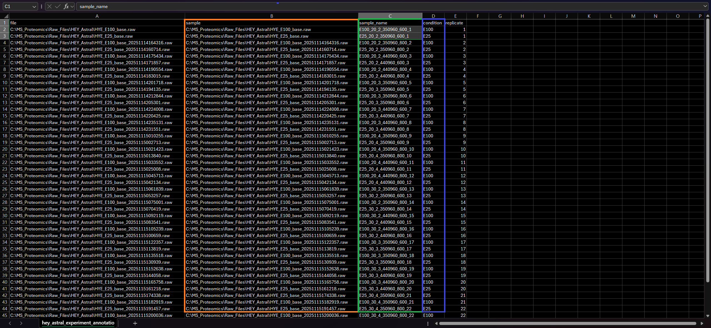

💡 **Optional:** Review `report.pg_matrix.tsv` to verify data quality. No modifications are typically needed.

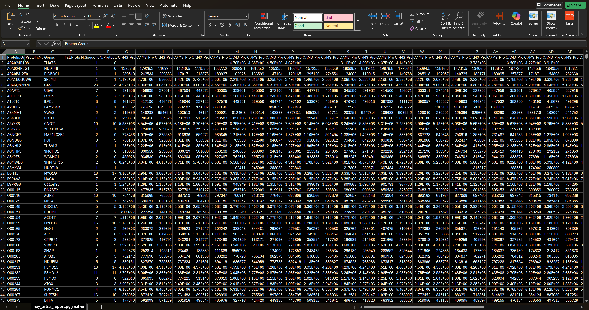

### Step 28: Upload files to Fragpipe Analyst

Return to Fragpipe Analyst and click **Browse** to upload: 1. Modified `experiment.annotation.tsv` 2. `report.pg_matrix.tsv`

Then click **Run**.

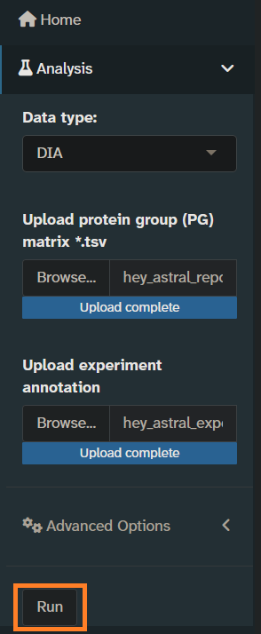

### Step 29: Explore results

Fragpipe Analyst will generate visualizations and statistical analyses. Explore the tabs for QC metrics, differential expression, and additional analyses.

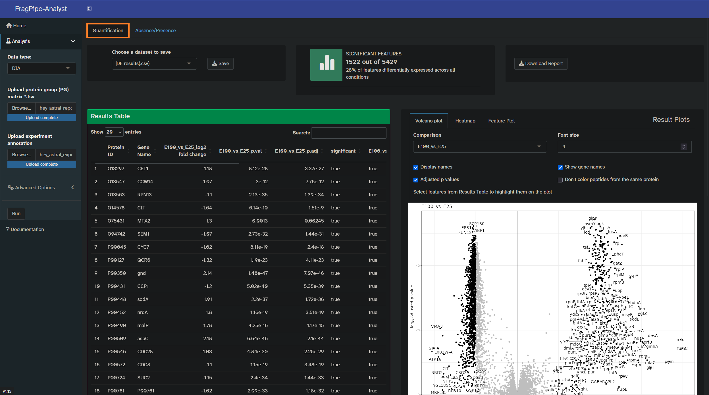

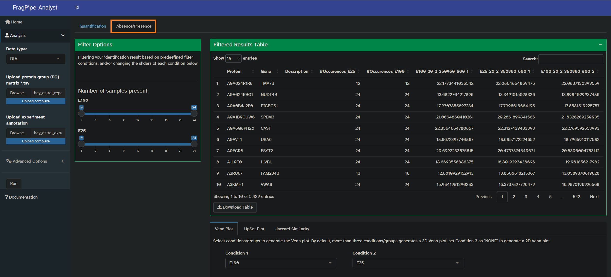

### Step 30: Export results (optional)

Use the export options in the results tabs to download tables, figures, or reports for further analysis.

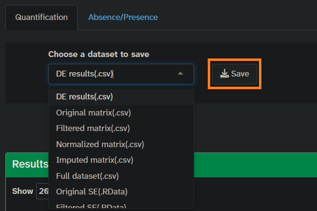